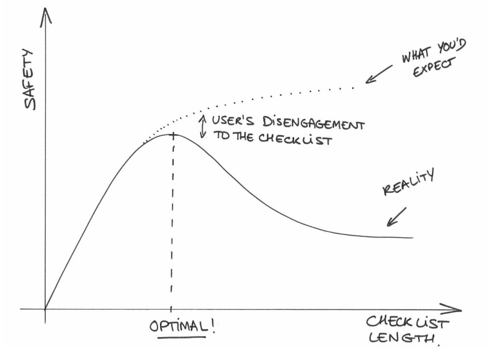
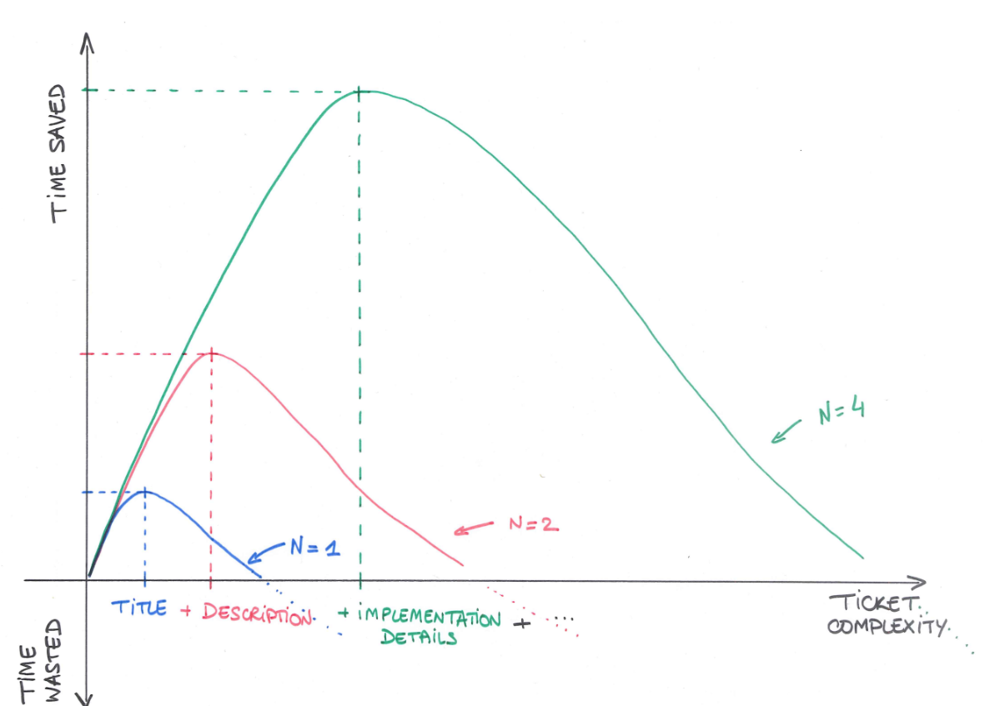
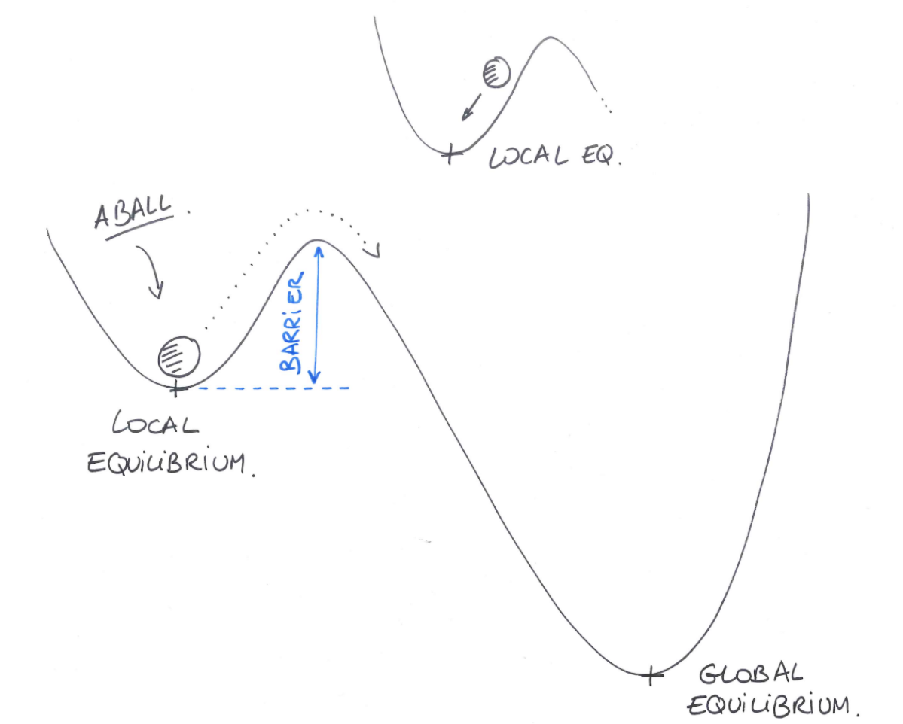

+++
author = "Noël"
title = "Balance the Process: How to Avoid Nightmares"
date = "2024-12-05"
draft = false
+++

We often create overly complex processes to address simple (or even nonexistent) issues, instead of creating simple processes to address complex problems. This approach is far from optimal as it leads to over-engineered and inefficient workflows.

To avoid these common pitfalls, I recommend adopting a more pragmatic approach. My method draws parallels with physical systems, which naturally evolve toward equilibrium and the most favorable state. Here’s how this perspective can guide better process design.

## Why do we define a process?

A process primarily exists to simplify or resolve a problem. These problems can be diverse and arise depending on the context—business needs, team dynamics, customer demands, company growth, and so on.

A well-defined process should address questions such as:

* How do we coordinate work within the team?  
* How do we delegate tasks or responsibilities?  
* How do we prioritize unexpected tasks or requests?  
* How do we ensure the work is completed effectively?  
* …and many more.

Numerous frameworks already provide answers to these types of questions. Rather than proposing a new framework, I want to share my experience in designing and implementing processes that address these challenges effectively.

## What is an Equilibrium?

As a former physicist, I’ve spent years studying how physical systems achieve equilibrium. Theoretically, equilibrium is the state where all constraints perfectly balance each other.

For example, imagine yourself floating on the sea: your weight, pulling you downward, is balanced by the Archimedes force, pushing you upward. When these opposing forces compensate, your body reaches a stable equilibrium, you are floating.

Thus, I postulate that introducing a process adds a new constraint to the system. This constraint should counteract the problem it’s designed to address (disorganization, bottlenecks, inefficiencies, …), by no means amplifying it. Otherwise, instead of floating, you might find yourself sinking into the abyss.

## Finding the Equilibrium

Let me introduce a process: the plane-takeoff checklist. It intends to improve the safety of the flight at a critical moment. When the plane is close to the ground, close to potential obstacles and, at a low speed.

I represented on the graph below the safety added by the takeoff checklist with respect to its length, e.i., the number of items to verify. We can see three zones under the plain line:

* **Safety improves with the number of items.** Adding items to the checklist helps address frequent and critical issues during takeoff, e.g., engine health, fuel levels, runway clearance…  
* **Safety reaches the maximum.** The checklist now covers the most frequent critical and mild issues at takeoff, and the pilot verifies all of those items.  
* **Safety decreases with the number of items.** Adding more verifications for minor or non-existent incidents can distract the pilot from the critical items, leading to a higher likelihood of overlooking them.

Naively, we should expect another behavior, the one in dashed lines. It sounds logical: the more verifications, the safer. But we made the process too complex, by adding too many verifications.  

## Real-Life Application

Previously, I deliberately used a non-tech example to illustrate the philosophy without focusing on details. Now, let’s dive into a practical, day-to-day scenario with the example of the task-delegation process. The goal is to address the following challenges in a timely and effective manner:

* How do we clearly define the task and its goals?  
* How do we estimate the effort required for the task?  
* How do we track the progress of the task?  
* Who is responsible for owning the task?

We propose mapping each task to a single post-it. The content on the post-it can vary, ranging from a simple title to more detailed information, including:

* Title  
* Owner  
* Status  
* Description  
* Implementation details  
* User story  
* Acceptance test  
* Dependencies  
* Estimate

The level of detail required on task post-its depends on team size. For a solo worker or a binome, minimal details like a title and brief description are sufficient, as the task creator and executor are the same. However, in larger teams, tasks often involve multiple stakeholders, such as managers, developers, and reviewers, making them interdependent. This significantly increases the number of interactions, which grows quadratically with team size (e.g., 4 people \= 12 potential interactions per task).

With numerous stakeholders, it can easily end up with overwhelming communication challenges, such as numerous Slack conversations and threads. To mitigate this, filling fields on the post-it will save time. It streamlines communication, reduces unnecessary back-and-forth, and ensures all stakeholders are aligned.

We need to balance the level of detail on each post-it according to the team size and its autonomy. As illustrated in the graph, the optimal amount of detail increases with the team size, helping save time when delegating tasks. On the other hand, if the process becomes too complex—similar to the takeoff checklist example—we will waste more time executing the process than completing the task itself.

In a nutshell, don’t get stuck on Agile, Scrum, or other dogmas. Take the best elements from each, adapt them, and create an optimal process tailored to your needs.

## Equilibria and Transitions

We’ve focused on equilibrium as a single state, but there’s also a distinction between local and global equilibria, as illustrated below.  

On the left, the local equilibrium is represented by the small cavity where the ball rests. It’s considered local because it’s not the most stable state. On the right, the global equilibrium, represented by the deeper cavity, is stabler. A useful analogy is stairs: standing on a step represents a local equilibrium, but the most stable zone is the ground beneath the stairs.  

Local equilibrium persists because of a barrier separating it from the global equilibrium. This barrier acts as a "tree hiding the forest," creating the illusion of being in the most favorable state, while a better one exists just beyond your view.  

These barriers are shaped by the context or environment (what physicists call potential barriers). In a workplace, barriers could stem from processes, organizational structures, habits, or even egos. To overcome them, take a step back and question established assumptions.  

Moving from a local equilibrium to a global one requires energy to overcome the barrier. During the transition, the system enters a non-equilibrium state where new opposing forces, like the fear of change, may arise, resisting progress toward the global optimum. If the effort stops prematurely, the ball will roll back to the local equilibrium.

To successfully overcome the barrier, it’s essential to align efforts and persuasion from team members and allies, focusing on the shared goal and working together to overcome resistance.

## Conclusion

A process is a tool designed to support you, your team, and your company by making work and collaboration easier. Always remember that its purpose is to simplify, not complicate. Avoid rigid adherence to dogmas, adapt processes to the context and regularly question their relevance. Additionally, implementing or proposing new processes requires energy and alignment. Don’t tackle it alone; collaborate with peers, iterate together, and incorporate their feedback to ensure success.