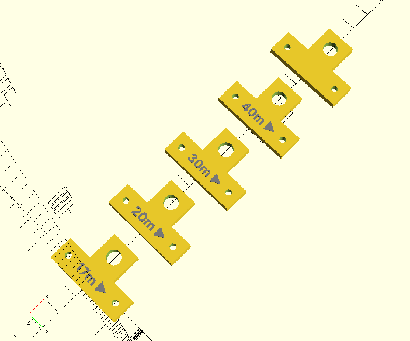
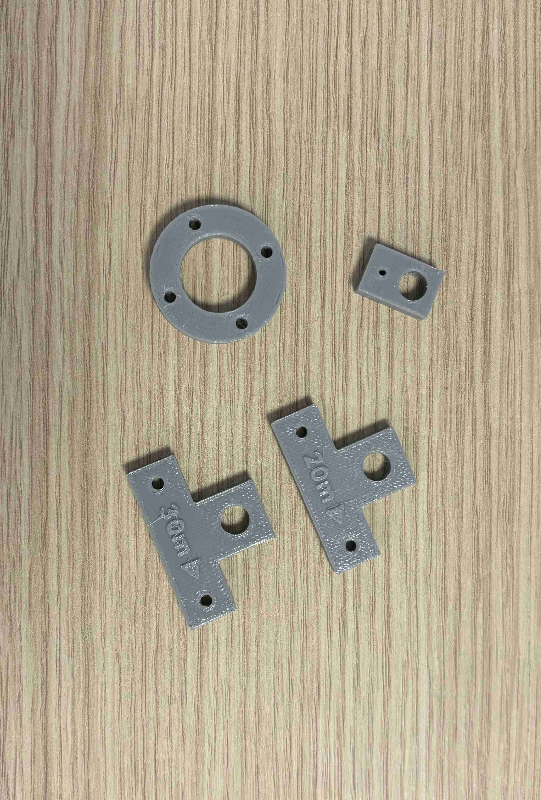

+++
author = "Noël"
title = "Construction d'une antenne long-fil EFHW multibande"
date = "2024-04-02"
draft = false
+++

Habitant en ville, il n'est pas simple de faire de la HF. Alors la majeure partie du temps
j'opère en HF en portable avec mon Yaesu FT-817 et un mat SOTA beams de 7m. Quant à l'antenne,
j'utilise une long fil de 10 mètres accordée sur la bande des 20 mètres. Plus précisément, c'est
une antenne _End-Fed Half-Wave (EFHW)_, que l'on traduirait probablement comme :
_antenne demie-onde alimentée par terminaison_.

Elle possède quatre avantages :
* une géométrie simple avec un seul élément radiant, donc facile à mettre en place n'importe où ;
* légère et compacte, elle s'emporte dans une petite poche de sac à dos ;
* très efficace, généralement j'arrive à me rapprocher de 1 à 1.2 SWR ;
* et enfin, elle s'accorde avec [un petit tuner 49:1 pour le QRP](https://qrpguys.com/end-fed-half-wave-sota-antenna-tuner), qui lui aussi est très léger.

Cependant cette configuration est monobande alors que le tuner en supporte 5 de 40 à 15 mètres.
C'est ainsi que j'ai entrepris la construction d'une antenne multibande.

## Théorie

Pour commencer, on trouvera une excellente description ce qu'est une antenne EFHW dans l'article de Steve Yates AA5TB[^1].
Elles correspondent à des antennes doublet demi-onde, où l'on alimenterait que d'un seul côté au lieu d'avoir une
alimentation centrale. Cette configuration donne à l'anntenne une très forte impédance de 1800 à 5000 ohms [^1].

### Transformateur d'impédance

Pour ce faire il est nécessaire d'avoir un tranformateur d'impédance d'un facteur 100:1 à 50:1. La transformation
d'impédance entre l'impédance d'entrée \(Z_E\) et celle de sortie \(Z_S\) est le carré du rapport du nombre de spires
respectivement, \(N_E\) en entrée et \(N_S\) en sortie, alors le rapport d'impédance est le suivant :
$$
\frac{Z_E}{Z_S} = \left ( \frac{N_E}{N_S} \right)^2 \,.
$$

Pour arriver à cela, on part de la définition d'un transformateur entre une tension \(U_E\) d'entrée et \(U_S\) de sortie :
$$
\frac{U_E}{N_E} = \frac{U_S}{N_S} \Leftrightarrow \frac{U_E}{U_S} = \frac{N_E}{N_S} \,.
$$

Exprimons la tension en fonction de la puissance \(P\) en suivant la loi d'Ohm :

$$
U = \sqrt{P \cdot Z} \,.
$$

Ainsi, en substituant \(U\) la définition d'un transformateur s'écrit :
$$
\sqrt{\frac{P_E \cdot Z_E}{P_S \cdot Z_S}} = \frac{N_E}{N_S}
$$

On suppose notre transformateur parfait, dans ces conditions les puissances d'entrée et de sortie
sont égales \(P_E = P_S\) et l'on retrouve le rapport des impédances ci-dessus. CQFD !

En conclusion pour des rapports d'impédances entre 100:1 et 50:1, il nous faudra des transformateurs entre 10:1 et 7:1
(les racines carrées des rapports d'impédances).

### Longueur des brins rayonnants

Aussi, comme son nom l'indique la longueur du brin radiant est de \(\lambda /2\). A cela près qu'il faut prendre en compte
le facteur \(K\) lié au rapport du diamètre du conducteur \(d\) de la longueur d'onde \(\lambda / 2d \)[^2].

Ce facteur s'exprime de la façon suivante :
$$
K = \frac{0.225706}{\ln \left ( \frac{\lambda}{2d} \right ) - 0.429451} \,,
$$
comme exprimé par Steve Steams, K6OIK.

Dans mon cas, pour une section 0.5 mm² le facteur se situe entre 0.97 et 0.98. La longueur des brins s'exprime de la manière
suivante ([feuille de calcul ODS](elements/lengths.ods)) :
$$
l (m) = K \frac{150}{f (MHz)} \,.
$$

| Bande | Centre (MHz) | λ/2 (m) | l (m) | Sections (m)
| -----|--------------|---------|-----------|--------------
| 15m  | 21.2         |7.08     | 6.86      | 6.86
| 17m  | 18.118       |8.28     | 8.03      | 1.17
| 20m  | 14.15        |10.60    | 10.28     | 2.25
| 30m  | 10.125       |14.81    | 14.37     | 4.09
| 40m  | 7.1          |21.13    | 20.49     | 6.12

### Contrepoids

Pour la longueur du contrepoids, le plus simple a été de suivre l'étude détaillée de Steves Yates, AA5TB[^1].
Il montre qu'un contrepoids de 0.05λ est purement resistif, pas de composante complexe, c'est à dire réactive.
Je vais donc partir sur ces dimenssions :

| Bande | Centre (MHz) | 0.05λ (m) | Sections (m)
| -----|----------|---------|--------------
| 15m  | 21.2   | 0.71 | 0.71
| 17m  | 18.118 | 0.83 | 0.12
| 20m  | 14.15  | 1.06 | 0.23
| 30m  | 10.125 | 1.48 | 0.42
| 40m  | 7.1    | 2.11 | 0.63

 ### Design simplifié


Pour l'instant, nous nous concentrerons que sur l'antenne au design complet. Celle ci sera pour une prochaine fois !


Selon plusieurs posts à droite à gauche et même certaines antennes comme celle de [DL2MAN](https://dl2man.de/portable-efhw-for-40-20-15-10m/)
un simple brin rayonnant de 20.5 mètres ferait l'affaire pour 4 bandes.

J'imagine pour cela dun design simplifié basé sur deux sections :
* l'une résonnant à 40 mètres, et théoriquement 20
* l''autre résonnant à 30 mètres, et théoriquement à 15 et 17

Ce qui nous donnerait les dimenssions suivantes :

| Bande     | l (m)     | Sections (m)
| ----------|-----------|---------
| 30-17-15m | 14.37     | 14.37
| 40-20m    | 20.49     | 6.12

## Matériel

Entre chacune des sections de l'antenne il me faut de petits isolateurs qui permettent d'isoler
ou non les brins entre eux. Pour ce faire, j'ai créé ces éléments avec [OpenSCAD](https://openscad.org/)
pour les imprimer en 3D. Ne me demandez pas comment et avec quelle matière ils ont été imprimés, c'est
un ami qui l'a fait pour moi.

### Liste

* Isolateurs, source [OpenSCAD](elements/isolators.scad) et [STL](elements/isolators.stl)
* Fil multibrin, 0.5 mm², usage en QRP dans mon cas 5W (Yaesu FT-817)
* Cosses à sertir, [exemple](https://www.amazon.fr/dp/B0CFQPBJT8?psc=1&ref=ppx_yo2ov_dt_b_product_details)

## Tests

À venir !

[^1]: [The End Fed Half Wave Antenna, _Steve Yates AA5TB_](https://www.aa5tb.com/efha.html)
[^2]: Amateur Radio Handbook, ARRL, Edition 100, Sec. 21.1.7