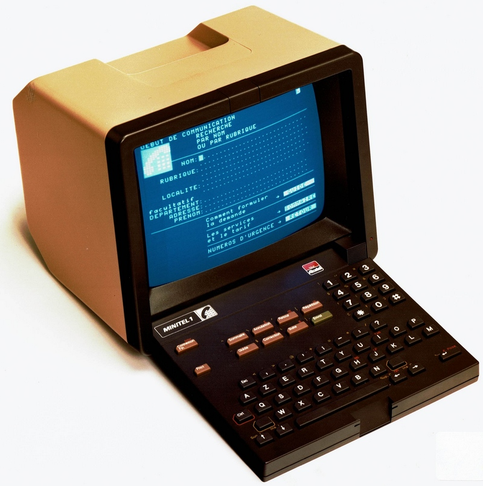
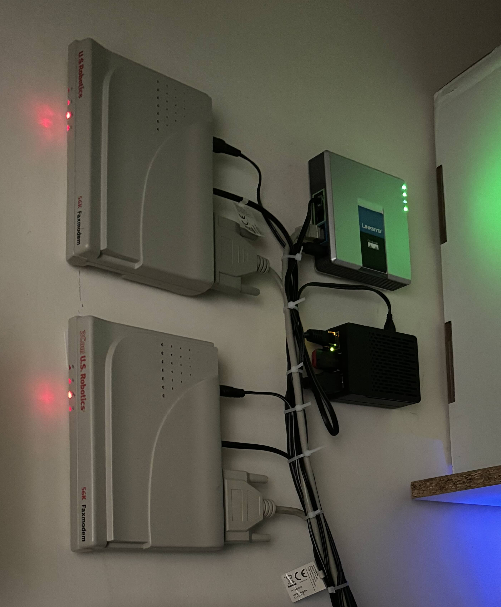

+++
author = "Noël"
title = "Connect a Minitel with a V.23 Modem"
date = "2024-11-04"
draft = false
+++

The [Minitel](https://en.wikipedia.org/wiki/Minitel) was a digital terminal developed by the French national operator France Télécom, offered free of charge to any landline subscriber from the 1980s to the early 2010s. Although immensely popular in France, the service was officially discontinued in 2012 by France Télécom, now known as Orange.

Interestingly, the Minitel used a V.23 modem (1200/75 baud) and can still connect to amateur servers using the same standard! As of 2024, there are still [a handful of servers](https://fr.wikipedia.org/wiki/Micro-serveur_Minitel) that remain active and accessible to Minitel enthusiasts.


The iconic Minitel 1B

## Understanding the Modem

Many modems compatible with the Minitel can be found on marketplaces like eBay and Leboncoin. For my setup, I chose a standard **US Robotics 56k Faxmodem** for its accessibility and detailed documentation.


A view of the _multivoie_ server with two US Robotics modems, accessible at +33 1 83 64 51 44

The modem interfaces with the computer using a serial connection following the [RS-232 standard](https://en.wikipedia.org/wiki/RS-232). This standard defines two key roles in the connection:

* **Data Circuit-terminating Equipment (DCE)**: The modem.
* **Data Terminal Equipment (DTE)**: The computer.

Communication between the DTE and DCE relies on the [Hayes AT command set](https://en.wikipedia.org/wiki/Hayes_AT_command_set), where each command begins with `AT`. For example, the command to answer a call is simply `A`, so the full instruction would be `ATA`.

For testing and communicating with the modem, I recommend using [minicom](https://packages.debian.org/en/sid/minicom). Be sure to run it with sudo privileges: `sudo minicom -D /dev/ttyUSB0`.

By default, the modem responds to key inputs and confirms command execution with messages such as:

* `OK`
* `ERROR`
* `CONNECT`

## Setting Up the Modem

To ensure consistent setup, reset the modem’s configuration at startup or after each call. The modem includes NVRAM (Non-Volatile RAM) which stores both manufacturer and user configurations. Configurations can be accessed with the `Zn` command, where `n` represents a specific configuration number.

For my setup, I use `ATZ0` to initialize the modem.

Once the modem is reset to a known state, you can customize it with your own configuration. Here is the configuration I use in my setup, also available [here](https://github.com/NoelM/minigo/blob/main/notel/notel-conf.json):

```
ATE0L0M0X4&A0&N2S0=1S27=16
```

* `E0`: No echo of the commands.
* `L0`, `M0`: Mute settings for quiet operation.
* `X4`: Sets high verbosity for detailed responses.
* `&A0`: Enables auto-answer after 0 rings.
* `&N2`: Set connect speed to 1200 baud.
* `S0=1`: Keeps the "Data Send Ready" signal active.
* `S27=16`: Configures fallback to the V.23 standard.

## Connection Basics

The RS-232 standard defines several status signals to monitor:

* **Ring Indicator (RI)**: Signals an incoming call when set to 1.
* **Data Carrier Detect (DCD)**: Indicates an established connection when set to 1.

When a call comes in, the `RI` bit flips to 1. The server software detects this change and monitors the `DCD` bit for up to 60 seconds. Since the modem is set with `&A0`, it automatically answers incoming calls. It then attempts to establish a connection, which we monitor through the `DCD` bit.

After monitoring the `DCD` bit for a minute, one of two outcomes occurs:

* If `DCD` is set to 1, the connection is established, and Minitel content delivery begins.
* If `DCD` remains at 0, the modem is reset, and the call handling process ends.

In addition to the `DCD` signal, the modem will also send a `CONNECT` message to the computer. With the verbosity setting at `X4`, I receive a message reading `CONNECT 1200/75`, indicating the connection speed.

## Tips for Smooth Operation

Vintage modems operate significantly slower than modern devices, so it’s essential to pause for about a second between each `AT` command or after the connection has been established. This timing ensures that commands are processed correctly and prevents miscommunication between the modem and the computer.

With this setup, you can easily connect a Minitel terminal to modern-day servers that support its protocol. Enjoy exploring the digital nostalgia of Minitel!