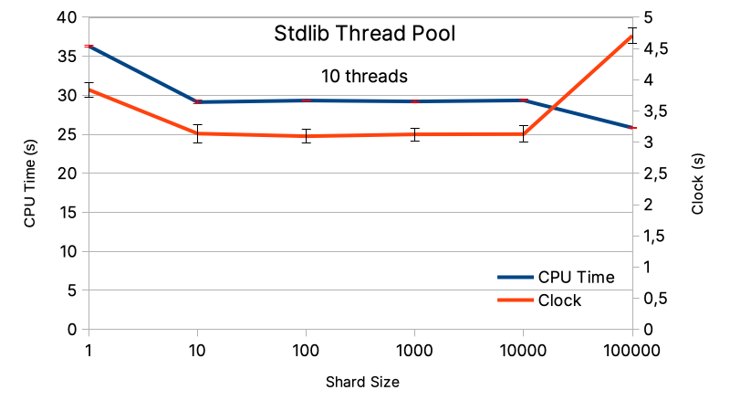
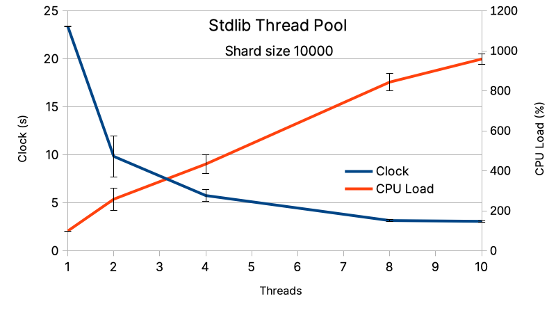
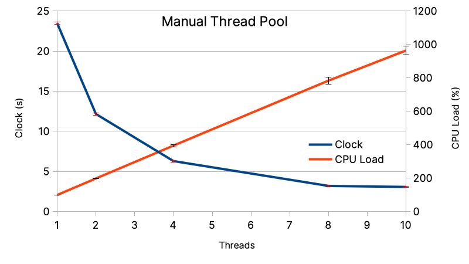
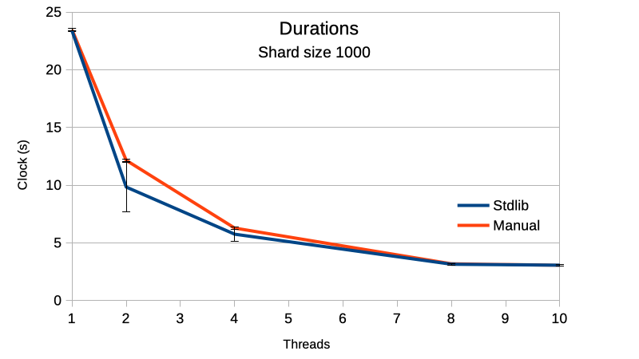

+++
author = "Noël"
title = "Zig Threading Tutorial"
date = "2023-08-16"
draft = false
+++

## Prequel

With the release of Zig `0.11.0`, the language introduced [channels](https://ziglang.org/documentation/0.11.0/std/#A;std:event.Channel)
like in Go. However, in the same release, they announced that the support of
[async functions is postponed](https://ziglang.org/documentation/0.11.0/#Async-Functions) (related
[Github issue](https://github.com/ziglang/zig/issues/6025)); they expect their support for the release `0.13.0`.

Initially, I wanted to test channels, but:

* `0.11.0` gets `Channel`, but unusable because it requires [await](https://ziglang.org/documentation/0.11.0/std/#A;std:event.Channel.get) functions
* `0.10.0` gets `async/await` support with the option `-fstage1`, but the `Channel` is not part of the language

Finally, I switched to the solution of _thread pools_.

## Introduction

In a previous post, I benchmarked [Zig versus C](https://noelmrtn.fr/posts/zig_and_c/) with a naive prime-number algorithm.
It used to be a single-threaded implementation; now, the goal is porting it into multi-threading.

The standard library of Zig has a type `std.Thread` that includes the basics of threading: `spawn`, `join`, `Mutex`... Also, it comes with
more advanced features, such as [thread pools](https://ziglang.org/documentation/0.11.0/std/#A;std:Thread.Pool) (they are not documented yet,
and this tutorial intends to be one proposition).

A _thread pool_ consists of a group of (OS or green) threads waiting to execute tasks. Typically, a _thread pool_ is designed to
accept a variety of tasks that are not assigned to a specific thread, maximizing the parallelism. Here, one accounts for a single task
defined as: testing whether an integer is prime or not.

I will detail two possible implementations:
* a manually spawned thread pool, where each thread is designed for a specific task;
* a managed-thread pool with `std.Thread.Pool`, where threads accept any task.

The complete code is published on [Github](https://github.com/NoelM/zig-playground/tree/main/prime_numbers_parallel).

## Thread-safe Structures

### Allocator

Zig does not perform any hidden allocation, they should be all explicit. So, memory allocation is performed with the help of
an allocator `std.mem.Allocator`, it is similar to the C `malloc`, but it accepts more options: heap, fixed buffer, arena...

Beware, a basic `std.mem.Allocator` is not suitable for concurrency. So in the context of multi-threading and concurrent 
memory allocations, the allocator must wrapped into a _thread-safe allocator type_ as follows.

```zig
var single_threaded_arena = std.heap.ArenaAllocator.init(std.heap.page_allocator);
defer single_threaded_arena.deinit();

var thread_safe_arena: std.heap.ThreadSafeAllocator = .{
    .child_allocator = single_threaded_arena.allocator(),
};
const arena = thread_safe_arena.allocator();
```

### Queues

The standard library (_stdlib_) provides a type `std.atomic.Queue(T: type)`. It allows multiple producers and readers performing
simultaneous operations with functions: `put`, `get`, `remove`... The queue items are structs of type `Node` with the required members:

```zig
pub const Node = struct {
    .prev: ?*Node = null,
    .next: ?*Node = null,
    .data: T,
}
```

A `?`-prefixed pointer is a so-called [_optional pointer_](https://ziglang.org/documentation/0.11.0/#Optional-Pointers),
which allows a null memory address (by default, a pointer in Zig is not nullable).

To deal with an optional pointer `?*T` you must check whether it points to a memory location or not.
One of the options is within an `if` statement:

```zig
if (optional_ptr) |ptr| {
    // acceded only if optional_ptr != null
    // the pointer address is casted to `ptr`
} else {
    // the optional_ptr = null
}
```

Or directly when accessing the value:

```zig
const val = optional_ptr.?.*;
```

#### Initialize and Fill Queues

Setting up a thread-safe queue is pretty easy. First, initialize it. Then, allocate nodes with the previously defined
thread-safe allocator.

```zig
const U64Queue = std.atomic.Queue(u64);

var int_to_test = U64Queue.init();

const node: *Node = try arena.create(Node);
node.* = .{
    .prev = undefined,
    .next = undefined,
    .data = value,
};
int_to_test.put(node);
```

As one can see, we set the values `.prev` and `.next` to `undefined`, they will be set the function `put`.

#### Get Nodes from Queue

One can safely access, from any thread, the `Queue` elements by calling `get`. It returns an optional node pointer `?*Node`, set to null if the
queue is empty. Consequently, before playing the `?*Node` value, test it:

```zig
if (int_to_test.get()) |node| {
    const value = node.data;
    // do sth. with the data
} else {
    // empty queue
}
```

## Thread Pool

A thread pool aims to maintain a group of always-running threads, in contrast with, a naïve implementation where one spawns and joins thread for every task.
Such approach may, if the tasks are short, overload the OS-thread scheduler and waste CPU power for non-computational tasks.

### Manual

First, we create a slice (and not an array because its size cannot be evaluated at compilation) of `std.Thread`.

```zig
var pool = try arena.alloc(std.Thread, cpu_count);
defer arena.free(pool);

for (pool) |*thread| {
    thread.* = try std.Thread.spawn(.{}, isPrimeRoutine, .{ &int_to_test, &int_prime });
}
```

Each thread runs a function `isPrimeRoutine`. The function reads a queue of integers, tests the queued integers, sends the test result,
and finally returns when the queue is empty.

```zig
pub fn isPrimeRoutine(int_to_test: *U64Queue, int_prime: *U64Queue) void {
    while (true) {
        if (int_to_test.get()) |node| {
            const value = node.data;

            var is_value_prime = true;
            var i: u64 = 2;
            while (i < value) : (i += 1) {
                if (value % i == 0) {
                    is_value_prime = false;
                    break;
                }
            }

            if (is_value_prime) {
                node.prev = undefined;
                node.next = undefined;
                int_prime.put(node);
            }
        } else {
            // empty queue
            return;
        }
    }
}
```

This example shows an interesting behavior of queues. The function `int_to_test.get()` returns a pointer `?*Node`, which is not deallocated by the `get`.
So, you can reuse the it for sending back the result of the test within another queue (`is_prime`), by taking care to set `.prev` and `.next` to `undefined`.

Finally, the classical `.join()` waits for all threads to end.

```zig
for (pool) |thread| {
    thread.join();
}
```


Previously, I presented an `arena` thread-safe allocator. But this implementation does not concurrent allocations, they are all
performed in the main thread.


`prime_manual.zig`: [Github](https://github.com/NoelM/zig-playground/blob/main/prime_numbers_parallel/prime_manual.zig)

### Standard Library

The type `std.Thread.Pool` from the _stdlib_ maintains a pool of threads. But instead of
putting integer to a queue, we spawn tasks (calls to functions) queued in a `RunQueue`.

```zig
const Pool = std.Thread.Pool;

var thread_pool: Pool = undefined;
try thread_pool.init(Pool.Options{
    .allocator = arena,   // this is an arena allocator from `std.heap.ArenaAllocator`
    .n_jobs = cpu_count,  // optional, by default the number of CPUs available
});
defer thread_pool.deinit();
```


Do not forget the `try` in front of `thread_pool.init()`, it catches the function's returned [error](https://ziglearn.org/chapter-1/#errors).
In Zig, the returned errors are specified by `!`-prefixed values, e.g., `pub fn foo() !int`.


Instead of spawning a task per integer, I spawn a task for a batch of integer. Actually, testing one integer per task
would require more CPU power to spawn the task itself than perform the integer test.

```zig
const value_max: u64 = 1000000;
const shard_size: u64 = 1000;

var value: u64 = 0;
while (value < value_max) : (value += shard_size) {
    try thread_pool.spawn(isPrimeRoutine, .{ &wait_group, &arena, value, shard_size, &int_prime });
}
```

So, each task checks in a range `[value ; value + shard_size[` all the prime numbers. In contrast with
the previous example, now it requires a thread-safe allocator to create new nodes. Because we allocates the results
nodes simultaneously in each parallel task.

#### Wait Group

The thread pool does not have a public `join` member but gets a `waitAndWork` instead and it requires a
wait group. It may sound odd, but mind to first `reset` the wait group before using it.
Because it contains an `std.Thread.ResetEvent` not initialized by default.

```zig
const WaitGroup = std.Thread.WaitGroup;

var wait_group: WaitGroup = undefined;
wait_group.reset();

// create thread pool, spawn tasks

thread_pool.waitAndWork(&wait_group);
```

`prime_std.zig`: [Github](https://github.com/NoelM/zig-playground/blob/main/prime_numbers_parallel/prime_std.zig)

## Performances

### Standard Library

Earlier I spoke about the CPU power balance between spawing a thread and performing an operation. The first benchmark presents for 10 threads the effect
of the shard size (or batch size) on the efficieny. On the left (shard size = 10), to many short tasks decrease the efficiency (100'000 task per thread).
On the right (shard size = 100'000, or 1 task per thread), the efficiency decreases because of the sharding too. Actually, the first task will test 
integers in the range of `1; 100'000`, and the last task in the range `900'001; 1'000'000`. But the bigger the integer, the more divisions are required
to test a prime number. In consequence the run is longer because the join waits for task thread to end. Having a smaller size of shards (1'000 or 10'000)
is more desirable because it distributes better the complexity among threads, instead of specializing one for the most complex tests (the biggest integers).





